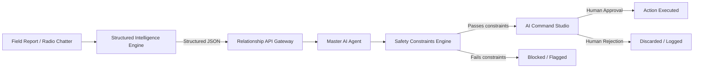

<div align="center">


<br/>

[](https://git.io/typing-svg)

<p align="center">
  <em>An AI-native operational intelligence platform for physical security operations, <br/>
  enhanced during OpenAI Build Week using <strong>OpenAI Codex Desktop</strong> as the primary development environment.</em>
</p>

<br/>

<p align="center">
  
  
  
</p>

<p align="center">
  
  
  
  
  
</p>


</div>

---

## ⚠️ A Note on AI Model Usage (Read This First)

This project makes a deliberate distinction that judges, contributors, and investors should understand up front:

| Layer | What it is | Model(s) used |
|---|---|---|
| **Development tooling** | The environment we used to *build and improve* the codebase during OpenAI Build Week | **OpenAI Codex Desktop**, powered by **GPT-5.6** |
| **Runtime inference** | The model(s) that power the *production application* when it processes a real incident | **Groq-hosted, Groq-compatible models** (e.g. Llama 3.3 70B Versatile), configurable per deployment |

**OpenAI models do not power the running application.** Codex Desktop and GPT-5.6 were our development environment and pair-programming partner throughout Build Week — they do not sit in the runtime request path. This is intentional and, per Build Week rules, acceptable: the requirement is that OpenAI tooling was used *during development*, not that OpenAI APIs serve production traffic. Every section below keeps this line clear.

---

## 📑 Table of Contents

- [Overview](#-overview)
- [Problem](#-problem)
- [Solution](#-solution)
- [Features](#-features)
- [Architecture](#-architecture)
- [Repository Structure](#-repository-structure)
- [What We Built During OpenAI Build Week](#-what-we-built-during-openai-build-week)
- [How OpenAI Codex Desktop Was Used](#-how-openai-codex-desktop-was-used)
- [How GPT-5.6 Helped Development](#-how-gpt-56-helped-development)
- [Tech Stack](#-tech-stack)
- [Installation](#-installation)
- [Running Locally](#-running-locally)
- [Environment Variables](#-environment-variables)
- [Demo Credentials](#-demo-credentials)
- [Testing](#-testing)
- [Project Structure](#-project-structure)
- [Screenshots](#-screenshots)
- [Demo Video](#-demo-video)
- [Roadmap](#-roadmap)
- [Contributors](#-contributors)
- [License](#-license)
- [Acknowledgements](#-acknowledgements)

---

## 🎯 Overview

**Lemtik Security** is a civilian-grade **C4I (Command, Control, Communications, Computers & Intelligence)** platform, built in Lagos, Nigeria, for African urban security operations — estates, hospitals, hotels, banks, and government facilities.

The platform already existed before OpenAI Build Week as a working, multi-service system with live incident management, patrol operations, routing, and a Groq-backed AI dispatch agent. During Build Week, we used the event as a forcing function to push the AI-native layer of the product further: structured intelligence extraction from messy field reports, an operator-facing "AI Command Studio," and a hardened safety layer that governs what the AI is and is not allowed to trigger autonomously.

## ❗ Problem

Security operations in dense African cities run on radio chatter, WhatsApp voice notes, and Pidgin-inflected field reports. That raw, unstructured communication rarely makes it into a structured incident record fast enough to matter, and there is no consistent gate that prevents an automated system from acting on a bad inference — dispatching the wrong resource, or worse, ignoring a safety constraint during an evacuation.

## ✅ Solution

Lemtik closes that gap in three parts:

1. **Structured Intelligence Engine** — turns raw radio/Pidgin field reports into normalized, structured incident data.
2. **AI Command Studio** — gives a human operator a clear, reviewable interface into what the AI is recommending and why, before anything is actioned.
3. **Safety Constraints Engine** — a dedicated validation layer that every AI-originated action must pass through, with human approval required and evacuation constraints that cannot be overridden.

The result is a shorter path from "something happened in the field" to "a verified, human-approved response," without removing the human from the loop.

---

## ⚡ Features

### Core Platform (Pre-Existing)

| Feature | Description |
|---|---|
| 🗺 Live Incident Map | Real-time map with severity-coded pins, officer positions, patrol routes, and heatmap overlay |
| 🤖 AI Command Panel | Ranked officer recommendations, route ETAs, one-click dispatch |
| 📋 Incident Lifecycle | Reported → Acknowledged → Responding → Contained → Resolved → Escalated |
| 🚶 Patrol Management | Route builder, shift scheduling, check-in tracking |
| 🧠 OSINT Intelligence Feed | Severity-scored, geo-relevant threat intelligence |
| 📦 Inventory Tracking | Officers, vehicles, fuel, weapons, tactical equipment |

### Built or Substantially Improved During OpenAI Build Week

| Feature | Description |
|---|---|
| 🗣 Radio Intelligence Parser | Parses Nigerian Pidgin and radio-style field reports into structured JSON |
| 📐 Incident Normalization | Maps parsed report fields onto the platform's canonical incident schema |
| 🖥 AI Command Studio | Operator-facing interface for reviewing AI-generated threat assessments and recommendations |
| 📊 Threat Confidence Visualization | Visual confidence scoring so operators can gauge how much to trust a given AI read |
| ✅ Human Approval Workflow | Every AI action recommendation routes through an explicit approve/reject step |
| 🛡 Safety Constraints Engine | Validates AI recommendations against hard safety rules before they can be actioned |
| 🔌 Gateway AI Routes | New Fastify proxy endpoints connecting the dashboard to AI-backed services |

---

## 🏗 Architecture

```
╔══════════════════════════════════════════════════════════════╗
║              LEMTIK SECURITY — SYSTEM OVERVIEW               ║
╚══════════════════════════════════════════════════════════════╝

┌─────────────────────────────────────────────────────────┐
│                 C4I DASHBOARD  (React)                   │
│     AI Command Studio · Confidence Visualization         │
│           Approval Workflow · Live Incident Map          │
└──────────────────────────┬──────────────────────────────┘
                           │ HTTPS + WebSocket / JWT
┌──────────────────────────▼──────────────────────────────┐
│              RELATIONSHIP API  (Fastify Gateway)          │
│   /ai/query · /ai/parse-report                            │
│   /ai/correlate-events · /ai/device-recommendations       │
└──┬──────────┬──────────┬──────────┬──────────┬──────────┘
   │          │          │          │          │
┌──▼──┐  ┌───▼──┐  ┌────▼──┐  ┌───▼──┐  ┌───▼───────────┐
│OSINT│  │ INV  │  │ROUTE  │  │PROX  │  │  AUTONOMOUS   │
│BRAIN│  │ SVC  │  │ CALC  │  │ FIND │  │  CONTROL      │
│     │  │      │  │Valhalla│  │Radar │  │  + Safety     │
│     │  │      │  │       │  │      │  │  Constraints  │
│     │  │      │  │       │  │      │  │  Engine       │
└─────┘  └──────┘  └───────┘  └──────┘  └───────────────┘
                          │
              ┌───────────▼───────────┐
              │    MASTER AI AGENT    │
              │   Runtime inference:  │
              │   Groq-compatible     │
              │   (e.g. Llama 3.3 70B)│
              └───────────────────────┘
                          │
         ┌────────────────▼────────────────┐
         │           SUPABASE               │
         │  sod schema · services schema    │
         │  PostgreSQL · RLS · Auth         │
         └──────────────────────────────────┘
```



> Runtime inference in the diagrams above (Master AI Agent) runs on Groq-compatible models. No OpenAI model sits in this path.

---

## 📂 Repository Structure

```
lemtiksecurity/
├── c4isod/lemtiksecurity-main/     # React 19 dashboard — AI Command Studio lives here
├── relationship_api/               # Fastify gateway — new /ai/* proxy routes
├── Internalservices/
│   ├── osint/                      # OSINT Brain (Python)
│   ├── inventoryservices/          # Inventory Service (Python)
│   ├── routecalculator/            # Route Calculator — Valhalla (Python)
│   ├── proximity/                  # Proximity / Officer Finder (Python)
│   ├── autonomouscontroller/       # Autonomous Control + Safety Constraints Engine (Python)
│   └── masterai/                   # Master AI Agent — Groq/Llama 3.3 (Python)
└── README.md
```

---

## 🛠 What We Built During OpenAI Build Week

### 1. Structured Intelligence Engine
A parsing layer that takes unstructured radio traffic and field reports — including Nigerian Pidgin phrasing — and converts them into structured, schema-conformant incident data.

- **Radio Intelligence Parser** — interprets radio-style and Pidgin field language into discrete fields (location, severity cues, actors, resource requests).
- **Structured JSON Extraction** — enforces a consistent output schema so downstream services never have to guess at shape.
- **Incident Normalization** — maps extracted fields onto the platform's canonical incident record, so a parsed report is immediately usable by the rest of the system.

### 2. AI Command Studio
An interactive operator interface built specifically to make AI involvement legible rather than opaque.

- **Interactive operator interface** for reviewing incoming AI-derived assessments.
- **Threat confidence visualization** — surfaces the model's confidence alongside its recommendation, rather than presenting a bare verdict.
- **Human approval workflow** — no AI recommendation is actioned without an explicit operator decision.
- **Action recommendation review** — operators can inspect the reasoning behind a suggested action before approving it.

### 3. Safety Constraints Engine
**Repository:** `autonomouscontroller`

**Purpose:**
- Validate AI recommendations before they can reach execution.
- Prevent unsafe or out-of-policy actions from being triggered automatically.
- Require human approval at the point of action.
- Never permit an action that would violate an evacuation constraint, regardless of AI confidence.

### 4. Gateway Routing
New Fastify proxy endpoints were added to the Relationship API to connect the dashboard to the AI-backed services above:

| Endpoint | Purpose |
|---|---|
| `POST /ai/query` | General-purpose AI query proxy for operator-initiated questions |
| `POST /ai/parse-report` | Sends raw field/radio text to the Structured Intelligence Engine |
| `POST /ai/correlate-events` | Requests correlation across related incidents/signals |
| `POST /ai/device-recommendations` | Requests device/resource recommendations tied to an incident |

### 5. Frontend
- New React components for the **AI Command Studio** workflow.
- A dedicated **operator workflow** for reviewing and approving/rejecting AI recommendations.
- **AI interaction panels** presenting confidence scores and recommendation detail.
- Improved **state propagation** so AI-derived updates flow consistently through the dashboard's existing state layer.

---

## 🤖 How OpenAI Codex Desktop Was Used

Codex Desktop was our primary development environment for the entirety of Build Week — not a one-off code generation tool we dipped into occasionally. Concretely, it was used for:

- **Multi-agent development workflow** — running parallel Codex sessions against different parts of the stack (Fastify gateway, Python services, React dashboard) and reconciling the resulting changes into a coherent diff.
- **Backend implementation** — writing and iterating on the Structured Intelligence Engine's parsing logic and the Safety Constraints Engine's validation rules inside `autonomouscontroller`.
- **React component generation** — scaffolding and refining the AI Command Studio's components (confidence visualization, approval workflow, recommendation review panels).
- **API integration** — wiring the new `/ai/*` Fastify routes to their corresponding Python services and to the dashboard's data layer.
- **Zod schema alignment** — keeping request/response schemas consistent between the Fastify gateway, the TypeScript frontend types, and the Python service payloads, and using Codex to catch drift between them.
- **Fastify routing** — implementing the new proxy endpoints, including error handling and request validation at the gateway layer.
- **Python service implementation** — extending `autonomouscontroller` and related services with new logic for constraint checking.
- **Debugging** — walking through failing integration points (e.g., schema mismatches between gateway and services) with Codex to isolate root causes.
- **Refactoring** — cleaning up state propagation in the dashboard as new AI panels were introduced, reducing prop-drilling and inconsistent update paths.
- **Documentation** — drafting and revising in-repo technical documentation, including this README.
- **Architecture planning** — reasoning through where the Safety Constraints Engine should sit in the request path (gateway vs. service-level) before implementation.
- **Code review** — using Codex as a second pass over changes before merging, particularly around the safety-critical validation logic.
- **Rapid iteration** — running quick build/test/fix loops across the Python services and the dashboard as features were shaped.
- **Repository-wide modifications** — changes that touched the gateway, multiple Python services, and the frontend in the same working session, kept consistent through Codex-assisted review.

## 🧠 How GPT-5.6 Helped Development

GPT-5.6 is the model underlying OpenAI Codex Desktop for this project. It is a **development-time reasoning and productivity tool**, not a runtime dependency of the deployed application. Specifically, it helped with:

- **Reasoning through architecture** — working through where the Safety Constraints Engine should intercept AI recommendations, and how to keep evacuation constraints non-overridable.
- **Refactoring** — restructuring dashboard state propagation as new AI-facing components were added.
- **Endpoint design** — shaping the `/ai/*` route contracts (inputs, outputs, error cases) before implementation.
- **Documentation** — producing clearer technical write-ups of what each new service and endpoint does.
- **Debugging** — helping trace issues across the gateway–service boundary during integration.
- **Validation logic** — reasoning through edge cases the Safety Constraints Engine needed to reject.
- **Implementation planning** — sequencing the Build Week workstreams (parser → gateway routes → operator UI → safety layer) so dependencies were built in the right order.
- **Developer productivity** — generally compressing the time between "we need X" and "X exists and works" across a small team.

**To be unambiguous:** GPT-5.6 does not run inside Lemtik Security in production, does not process live incidents, and is not called by any deployed service. Its role was entirely in the development loop, via Codex Desktop.

---

## 🛠 Tech Stack

<table>
<tr>
<td width="50%">

### Frontend
| Technology | Purpose |
|---|---|
| React 19 | UI framework |
| TypeScript | Type safety, strict mode |
| Vite | Build tool |
| Tailwind CSS | Styling |
| TanStack Query | Server state |
| Zustand | Client state |
| Mapbox GL JS | Interactive maps |
| Socket.io | Real-time updates |

</td>
<td width="50%">

### Backend & Services
| Technology | Purpose |
|---|---|
| Node.js / Fastify | Relationship API gateway, `/ai/*` routes |
| Python | OSINT, Inventory, Route, Proximity, Autonomous Control, Master AI Agent services |
| Supabase (PostgreSQL) | Dual-schema database (`sod`, `services`), Auth, RLS |
| Upstash Redis | Cache / job queue |
| **Groq API (Llama 3.3 70B)** | **Runtime inference** for the Master AI Agent |

</td>
</tr>
</table>

### Development Tooling (Build Week)

| Tool | Role |
|---|---|
| **OpenAI Codex Desktop** | Primary development environment for the entire Build Week workstream |
| **GPT-5.6** | Reasoning/generation model underlying Codex Desktop sessions |

---

## 🚀 Installation

```bash
# Clone the repository
git clone https://github.com/lemtikuniversalconcept/lemtiksecurity.git
cd lemtiksecurity

# Dashboard
cd c4isod/lemtiksecurity-main
pnpm install

# Gateway
cd ../../relationship_api
npm install

# Python services (repeat per service directory)
cd ../Internalservices/autonomouscontroller
pip install -r requirements.txt
```

## 🏃 Running Locally

Services must start in this order:

```bash
# Terminal 1-6: Internal Python services
cd Internalservices/osint                && python app.py    # :8001
cd Internalservices/inventoryservices     && python app.py    # :8002
cd Internalservices/routecalculator       && python app.py    # :8003
cd Internalservices/proximity             && python app.py    # :8004
cd Internalservices/autonomouscontroller  && python app.py    # :8005 (Safety Constraints Engine)
cd Internalservices/masterai              && python main.py   # :8006

# Terminal 7: Relationship API (gateway) — start after backend services
cd relationship_api && npm run build && npm start              # :3000

# Terminal 8: Dashboard
cd c4isod/lemtiksecurity-main && pnpm dev                       # :5173
```

## 🔐 Environment Variables

```env
# Dashboard (.env.local)
VITE_SUPABASE_URL=
VITE_SUPABASE_ANON_KEY=
VITE_RELATIONSHIP_API_URL=      # http://localhost:3000 for local dev
VITE_MAPBOX_TOKEN=

# Relationship API / Gateway
SUPABASE_SERVICE_ROLE_KEY=
GROQ_API_KEY=                   # Runtime inference (Master AI Agent) — NOT an OpenAI key
```

> Note: There is no OpenAI API key in the runtime environment variables above. OpenAI tooling (Codex Desktop) is used at development time only and has no corresponding runtime configuration.

## 🔑 Demo Credentials

Demo credentials for judges will be provided separately via the Devpost submission (not committed to this repository for security reasons). If you're reviewing this for the hackathon and haven't received access, please reach out via the contact details below.

## ✅ Testing

Testing coverage is being actively expanded. Current focus areas:

- Safety Constraints Engine: rule-based validation cases (including evacuation-constraint scenarios)
- Structured Intelligence Engine: parser output against known sample field reports
- Gateway routes: request/response contract checks for the new `/ai/*` endpoints

## 📂 Project Structure

See [Repository Structure](#-repository-structure) above for the top-level layout.

## 🖼 Screenshots

_To be added — dashboard and AI Command Studio screenshots will be included ahead of the Devpost submission deadline._

## 🎥 Demo Video

_To be added — a walkthrough video will be linked here for the Devpost submission._

## 🗺 Roadmap

- [ ] Expand automated test coverage for the Safety Constraints Engine
- [ ] Additional language/dialect coverage in the Radio Intelligence Parser
- [ ] Broader correlation logic behind `/ai/correlate-events`
- [ ] Formal audit log migration for AI-approval decisions

## 👥 Contributors

| Name | Role |
|---|---|
| Amisu Abdulsemiu Omotoyosi | Founder & CEO — Product vision, platform architecture |
| Honourable Onovwiome | Lead Software Engineer — Backend systems, API architecture |
| Ridwanulah Pedro | Frontend UI Engineer — C4I dashboard, AI Command Studio |
| Mariana Olufunke | Growth & Product Marketing |
| Benita Ochokoma | Strategy & Operations |

## 📄 License

Proprietary and confidential. Unauthorised access, reproduction, or distribution is strictly prohibited. © 2026 Lemtik Security. All rights reserved.

## 🙏 Acknowledgements

- **OpenAI Build Week** — for the occasion and framework that shaped this development sprint.
- **OpenAI Codex Desktop** — the development environment used throughout Build Week.
- **Groq** — for the runtime inference infrastructure powering the Master AI Agent in production.

---

<div align="center">


**Built in Lagos, for Africa.** Development accelerated during OpenAI Build Week using OpenAI Codex Desktop.

</div>
